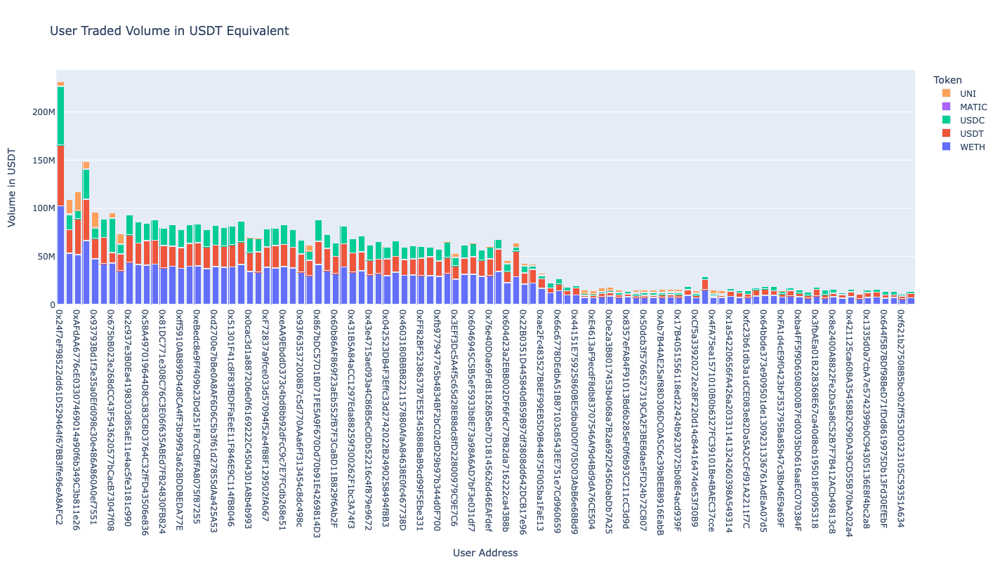
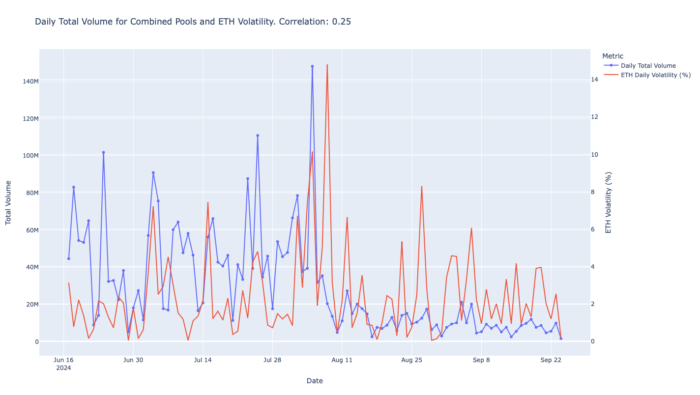

# Multi-Asset User Profit and Correlation Analysis

This project analyzes multi-asset user profit data, identifies the most active and profitable users, and examines the correlation between trading volume and volatility of ETH. The analysis is performed on the WETH/USDC, WETH/USDT, WETH/MATIC, WETH/UNI and WETH/DAI trading pairs. Key steps include fetching data from a PostgreSQL database, calculating user profitability, and conducting a correlation test between transaction volume and ETH volatility.

Table of Contents

	1.	Project Overview
	2.	Data Pipeline
	3.	Usage Instructions
	4.	Analysis Steps
	5.	Results and Interpretation

Project Overview

The goal of this project is to identify the most active and profitable users across WETH/USDC, WETH/USDT, WETH/MATIC, WETH/UNI and WETH/DAI trading pairs, calculate user profitability, and analyze correlations between “standardized” daily transaction volume and ETH volatility. By using percentile filtering, we aim to isolate significant trading days and assess correlations with ETH’s price volatility.

Data Pipeline

	1.	Data Fetching:
	•	Fetch transaction data from a PostgreSQL database, focusing on data associated with the “from” address of each transaction.
	•	Group transactions by trading pair (or “contract name”), and save the data in JSON format, with each contract saved as a separate file.
	2.	Profit Analysis:
	•	Run multi-asset user profit analysis specifically on the WETH/USDC and WETH/USDT pairs.
	•	Calculate profitability by determining gains/losses for each user based on their transactions.
	•	Identify the most active and profitable users for further analysis.
	3.	Correlation Analysis:
	•	Using the identified profitable users, calculate a “standardized” daily transaction volume and correlate it with the daily volatility of ETH.
	•	Volatility is calculated as the absolute percentage change in ETH closing prices day-over-day.
	•	Apply filtering, such as percentile filtering, to focus on days with extraordinary trading activity, improving correlation accuracy.


Libraries used: sqlalchemy, plotly, web3, glob, os, datetime, pandas, matplotlib.pyplot, os, json.

Usage Instructions

	1.	Step 1: Data Fetching
	•	Run the data-fetching script to retrieve transaction data from the PostgreSQL database and save it as JSON files. Takes too much time (hours if not days). Provided 'pools' folder already contains necessary files.
	•	Example command:

	```
	python fetch_data.py
	```

	2.	Step 2: Profit Analysis
	•	Run the profit analysis script on the WETH/USDC and WETH/USDT pairs to calculate user profitability and identify the most active users.
	•	Example command:
	
	```
	python analyse_users.py
	```

    	3.	Step 3: Correlation Analysis
	•	Use the correlation analysis script to examine the relationship between standardized daily volume and ETH volatility.
	•	This step applies filtering to focus on significant trading days.
	•	Example command:

	```
	python visualise_correlation.py
	python total_volume_correlation.py
	```
Analysis Steps

	1.	Data Fetching:
	•	Connect to the PostgreSQL database and query transactions associated with the “from” address for each contract.
	•	Group transactions by trading pair (contract name) and save the data into JSON files for easier access and further processing.
	2.	Multi-Asset Profit Analysis:
	•	For each JSON file, calculate profitability based on the transaction history, taking into account the WETH/USDC and WETH/USDT pairs.
	•	Use criteria such as transaction volume, number of trades, and net profit to identify the most active and profitable users.
	3.	Correlation Analysis of Transaction Volume and Volatility:
	•	Using data from profitable users, calculate the standardized volume for each day.
	•	Compute ETH volatility as the absolute percentage change between the ETH closing price for the day and the previous day.
	•	Filter the data to identify extraordinary trading days (e.g., days with activity above the 90th percentile).
	•	Perform correlation analysis to assess the relationship between trading volume and volatility on these significant days.

Results and Interpretation


  		
	1.	Profitability Metrics:
	•	Identify the top users in terms of profitability and trading activity for the selected pairs.
	•	Provide insights into the behaviors of the most successful traders, such as average trade volume and frequency.

	2.	Correlation Insights:
	•	The correlation analysis examines whether trading volume from the most active and profitable users aligns with market volatility in ETH.
	•	Filtering based on percentile thresholds (e.g., top 10%) helps isolate significant activity days, offering a more targeted view of user influence on volatility.

	3.	Interpretation:
	•	High correlation values might indicate that high-volume trading days tend to coincide with higher ETH volatility.
	•	This insight could suggest that certain traders or pools influence ETH’s market stability.

	
